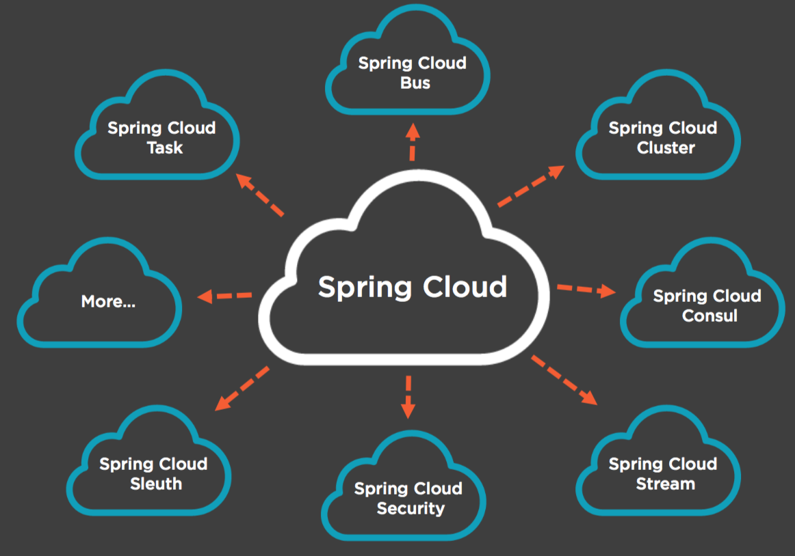

# Microservices

This Document will describe how the different spring cloud components will be added in a project and how they work together. I will use different branches for the different spring cloud packages. The Master Branch has the whole project included. The documentation will have a focus on deploying the spring cloud environment in Cloud Foundry on the SAP Cloud Platform.

**Table of Contents**

* [Create empty gradle project](#bootstrap)
* [Config Server (Distributed Configuration)](#config)
* [Eureka Server (Discovery Service)](#eureka)
* [Zuul (API Gateway / Intelligent Routing)](#zuul)
* [Feign](#feign)
* [Hystrix (Circuit Breaker)](#hystrix)
* [Sleuth](#sleuth)
* [Zipkin](#zipkin)
* [Spring Cloud Stream](#cloudstream)
* [Links](#links)

# Create empty gradle project

First we need to create a core project for our whole spring cloud environment

The empty project should look like [this](https://github.com/arthurliebhardt/spring-cloud-setup-documentation/tree/empty-gradle-project) than.

# Eureka Server (Discovery Service)

 Eureka client and server, Configuration, Health & High Availability, sDashboard

### 1. Generating Spring Boot Application
 Generate a Spring Boot application with the **Eureka server** dependency

# Zuul (API Gateway / Intelligent Routing
Feign / Ribbon ( Client-side Load Balancing)

# Hystrix (Circuit Breaker)

# Sleuth

# Zipkin

# Spring Cloud Stream

# Links
 - https://blog.novatec-gmbh.de/spring-cloud-sprint-a-fast-and-comprehensive-spring-cloud-services-tutorial/#flight-aggregation-frontend-impl
- https://github.com/joshlong/cloud-native-workshop
- https://blogs.sap.com/2017/11/08/centralized-configuration-of-spring-boot-applications-using-sap-cloud-platform/
-https://www.youtube.com/watch?v=5q8B6lYhFvE - Cloud Native Java - Josh Long