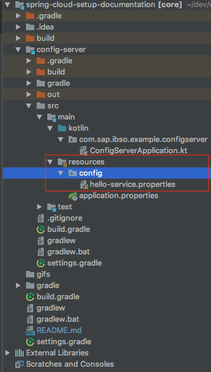
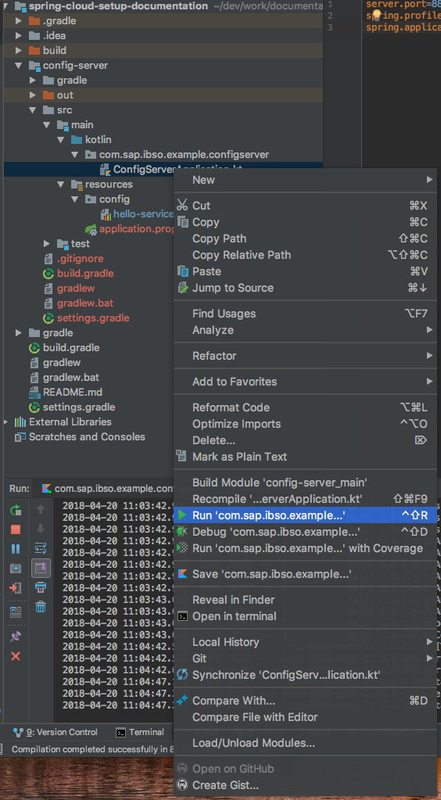

# Config Server (Distributed Configuration)<a name="config"></a>

The Config Server is the central source of all configuration files which are saved in an own git repository. So its an distributed configuration to all connected microservices.

## Config Server with native configs and remote configs

### 1. Generating Spring Boot Application
Generate a Spring Boot application with the **Config Server** dependency and including it in our core gradle project.

#### build.gradle
[buil.gradle](https://github.com/arthurliebhardt/spring-cloud-setup-documentation/blob/config-server-native/config-server/build.gradle) in Github config-server branch
```gradle
compile('org.springframework.cloud:spring-cloud-config-server')
```


### 2. @EnableConfigServer in *ConfigServerApplication*
[ConfigServerApplication](https://github.com/arthurliebhardt/spring-cloud-setup-documentation/blob/config-server-native/config-server/src/main/kotlin/com/sap/ibso/example/configserver/ConfigServerApplication.kt) in Github config-server branch
```kotlin
@SpringBootApplication
@EnableConfigServer
class ConfigServerApplication
fun main(args: Array<String>) {
runApplication<ConfigServerApplication>(*args)
}
```
### 3. Add application.properties attributes for finding configs
#### Native Configuration
##### application.properties
```ini
server.port=8888
spring.profiles.active=native
spring.application.name=config-server
```
With the property spring.profiles.active=native we are able to store configs in an config folder withing the config server and it recognize it.

#### Remote Configuration (Git Repository)
##### application.properties
The other and better approach for an productive version is using an github repository for storing all configs of the different applications.

```ini
server.port=8888
spring.cloud.config.server.git.uri=https://github.com/arthurliebhardt/spring-cloud-configs-example.git
```

[Config Server Remote Repository](https://github.com/arthurliebhardt/spring-cloud-setup-documentation/tree/config-server-remote-repository)
## 4. Store Configs

#### Native Configuration
We need to create a new config folder in the resources folder and create there your configs.

[Resource folder in GitHub](https://github.com/arthurliebhardt/spring-cloud-setup-documentation/tree/config-server-native/config-server/src/main/resources)


#### Remote (Github Repository)
You can create just a new Github repository and push there your property files which should have the same name as the *spring.application.name* of the projects.
Here is an example Repository:

[Config GitHub Repository](https://github.com/arthurliebhardt/spring-cloud-configs-example)

## 3. Test it locally
Lets start the application with right click on the ConfigServerApplication Run ...



If the tomcat started successfully we can reach the config server under http://localhost:8888 . At the moment we have only one config there, the hello-service.properties. So under http://localhost:8888/hello-service/default we can access the properties we definded in JSON format.

The output is the following:

```json
// 20180420110447
// http://localhost:8888/hello-service/default

{
"name": "hello-service",
"profiles": [
"default"
],
"label": null,
"version": null,
"state": null,
"propertySources": [
{
"name": "classpath:/config/hello-service.properties",
"source": {
"server.port": "8888"
}
}
]
}
```


## 4. Push it to the cloud

We need to create a manifest.yml which we will put in the root folder of our project.

```yml
---
applications:
- name: config-server
host: config-server
path: build/libs/config-server-0.0.1-SNAPSHOT.jar
memory: 1024M
```

then we need to login into cloud foundry
```bash
cf login -a https://api.cf.eu10.hana.ondemand.com -u "YourEmail@mail.com"
```

After successful login we push it finally with the following comment
```bash
cf push
```
As we want to use this config server in other applications an use it as a service we need to make an user provided service in our cloud foundry.
```bash
cf cups config-server -p '{"uri": "https://sc-config-server.cfapps.eu10.hana.ondemand.com"}'
```
cups is an abbreviation for create-user-provided-service.

//TODO GIF Service instances and url

//TODO scp fails to parse it right or so... need to explain
