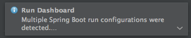
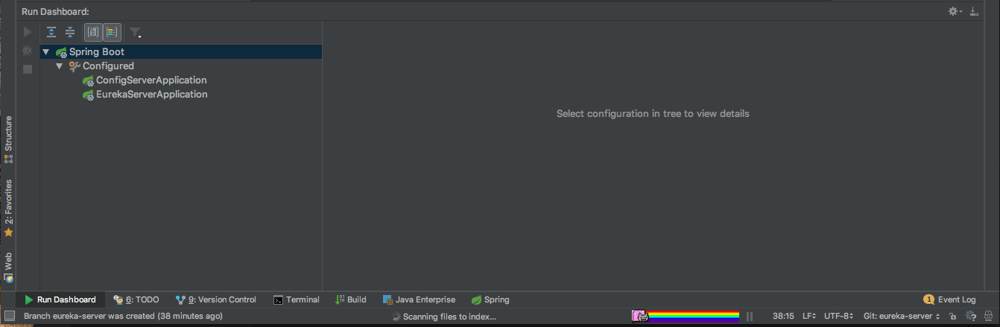
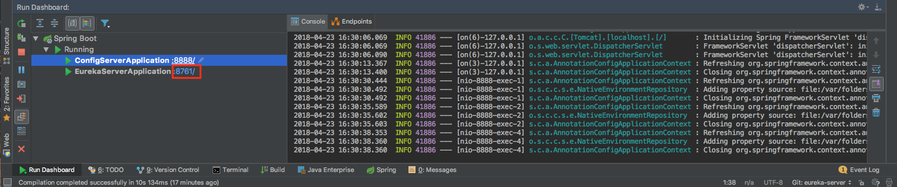

# Eureka Server (Discovery Service)<a name="eureka"></a>

Eureka Server is a discovery service ...

### 1. Generating Spring Boot Application
 Generate a Spring Boot application with the `Eureka Server` and `Config Client` dependency

##### build.gradle [GitHub](https://github.com/arthurliebhardt/spring-cloud-setup-documentation/blob/eureka-server/eureka-server/build.gradle)
```gradle
compile('org.springframework.cloud:spring-cloud-starter-config')
compile('org.springframework.cloud:spring-cloud-starter-netflix-eureka-server')
```
//TODO


### 2. `@EnableEurekaServer` in `EurekaServerApplication`
##### EurekaServerApplication.kt [GitHub](https://github.com/arthurliebhardt/spring-cloud-setup-documentation/blob/eureka-server/eureka-server/src/main/kotlin/com/sap/ibso/example/eurekaserver/EurekaServerApplication.kt)
```kotlin
@EnableEurekaServer
@SpringBootApplication
class EurekaServerApplication
fun main(args: Array<String>) {
    runApplication<EurekaServerApplication>(*args)
}
```

### 3. Delete `application.properties` and add a `bootstrap.properties`

##### bootstrap.properties [GitHub](https://github.com/arthurliebhardt/spring-cloud-setup-documentation/blob/eureka-server/eureka-server/src/main/resources/bootstrap.properties)
```ini
spring.application.name=eureka-server
spring.cloud.config.uri=${vcap.services.config-server.credentials.uri:http://localhost:8888}
```

### 4. Create `eureka-server.properties` config in config repository
**IMPORTANT**: The config name should be the same as the `spring.application.name`. In our case `eureka-server.properties`.

##### eureka-server.properties [GitHub Config Server](https://github.com/arthurliebhardt/spring-cloud-configs-example/blob/master/eureka-server.properties)

```ini
server.port=${PORT:8761}

eureka.client.register-with-eureka=false
eureka.client.fetch-registry=false
```

### 3. Test it locally
For testing the application locally we need to start first the `config-server` and then the `eureka-server`. IntelliJ IDEA provides a Spring Run dashboard where we can start, debug and stop multiple Spring Boot Applications.

IntelliJ IDEA detects two spring boot applications and shows an Run Dashboard popup:



After opening the Run Dashboard it shoud look like this:



Then we need to start the Config Server first and Eureka Server after it. The Eureka Server connects to the Config Server and gets the Config. If everything went fine the Eureka Server ist started at port 8761 like in the screenshot.



On http://localhost:8761/ we should see the Eureka Dashboard without any connected services there.

Here is a GIF with the startup.


### 4. Push it to the cloud

The `manifest.yml` contains the usual settings. We added here the services section where we bind the user provided `config-server` to our eureka server application.

##### eureka-server.properties [GitHub](https://github.com/arthurliebhardt/spring-cloud-setup-documentation/blob/eureka-server/eureka-server/manifest.yml)
```yml
---
applications:
- name: eureka-server
  host: eureka-server
  path: build/libs/eureka-server-0.0.1-SNAPSHOT.jar
  memory: 1024M
  services:
  - config-server
```

then we need to login into cloud foundry
```bash
cf login -a https://api.cf.eu10.hana.ondemand.com -u "YourEmail@mail.com"
```

After successful login we push it finally with the following comment
```bash
cf push
```
As we want to use this eureka server also as an own service in other applications, so we create a user provided service from it.

```bash
cf cups eureka-server -p '{"uri": "https://eureka-server.cfapps.eu10.hana.ondemand.com"}'
```
cups is an abbreviation for create-user-provided-service.
